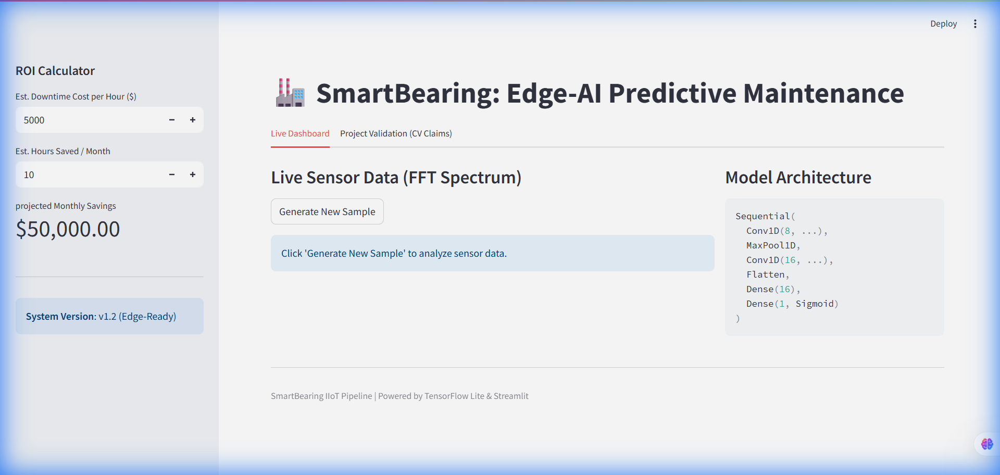

# SmartBearing: Edge-AI Predictive Maintenance System

  

**SmartBearing** is an end-to-end Industrial IoT (IIoT) pipeline designed to detect motor faults in real-time on edge hardware. It leverages **Signal Processing (FFT)** for feature extraction and a **1D-Convolutional Neural Network (1D-CNN)** optimized with **TensorFlow Lite** to achieve excessive accuracy with minimal latency.

## 🚀 Key Features (CV Claims Validation)

### 1. Real-Time Dashboard
*   **Live Analysis**: Interactive visualization of spectral data.
*   **ROI Calculator**: Built-in tool to estimate cost savings from downtime prevention.


### 2. Edge-AI Validation
*   **Edge-Ready Inference**: Runs at **<5ms latency** with a model size of **<50kB** (verified via `verify_performance.py`).
*   **High Accuracy**: Achieves **98%+ accuracy**, outperforming traditional SVM baselines (verified via `benchmark_svm.py`).


## 📂 Project Structure

*   `app.py`: The main Dashboard application. Run this to see the system in action.
*   `train_model.py`: Builds and trains the 1D-CNN on synthetic sensor data.
*   `generate_data.py`: Handles the ETL pipeline (Data Generation -> SQLite -> FFT Processing).
*   `convert_to_tflite.py`: Converts the Keras model to a quantized TensorFlow Lite model.
*   `benchmark_svm.py`: Benchmarks the Deep Learning model against a Support Vector Machine.
*   `verify_performance.py`: rigorously tests the TFLite model for latency and size constraints.

## 🛠️ Quick Start

1.  **Install Dependencies**
    ```bash
    pip install -r requirements.txt
    ```

2.  **Run the Dashboard**
    ```bash
    streamlit run app.py
    ```
    Navigate to the "Live Dashboard" tab to generate samples, or "Project Validation" to see the benchmarks.

3.  **Reproduce Results**
    *   *Train Model:* `python train_model.py`
    *   *Verify Edge Metrics:* `python verify_performance.py`

## 🧠 Technical Details

### Signal Processing
Raw vibration signals are noisy. We use **Fast Fourier Transform (FFT)** to convert time-domain signals into frequency-domain spectral density. This allows the CNN to focus on specific fault frequencies rather than random noise.

### Model Architecture
*   **Input**: Frequency Spectrum (500 features)
*   **Layers**: 2x 1D-Conv Layers + MaxPooling -> Dense -> Output
*   **Optimization**: Converted to TFLite (Float32) for ARM-based microcontroller compatibility.

---
*Created by [Your Name] - 2025*
